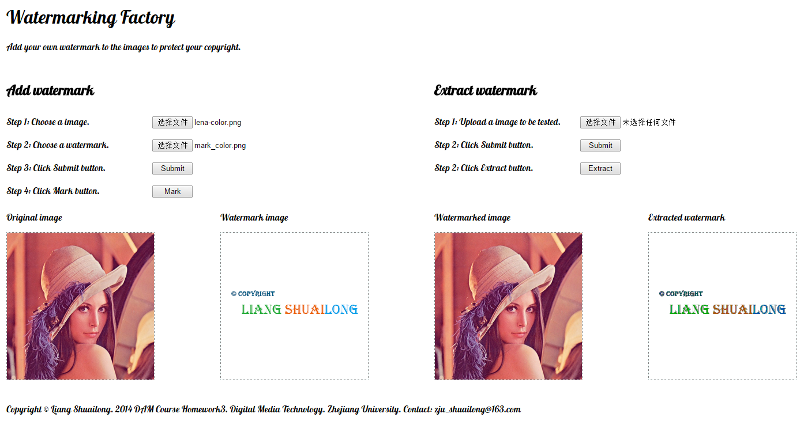

#ImageWatermarking

###Introduction
Watermark Factory is a simple website to help you add your own watermark to your image. You can also try to extract watermark from an image to check if it is your image.

###Demonstration
[Watermark Factory](http://watermark.coding.io/ "Watermark Factory")

###Feature
1. Freely choose your image to be added watermark and your watermark image.
2. Extract watermark from an image to see if it is your watermark.
3. Support color image in PNG format with a 32 bit depth. 

###Issue
1. Size is restricted to 255*255 for all image.
2. Format of the image is restricted to PNG.
3. Extracted watermark has only 4 scales for each RGB channel although it is distinguishable.

###Technology
- Server end: Nodejs(libs: express, ejs, formidable, gm, pngjs)
- Browser end: HTML, CSS, jQuery

###Author
Liang Shuailong(@handsome)

###TODO
1. Robust guarantee.
1. Support image of size other than 255*255(by resizing or croping).
2. Support image formats other than PNG(by convert image format).

###Preview

